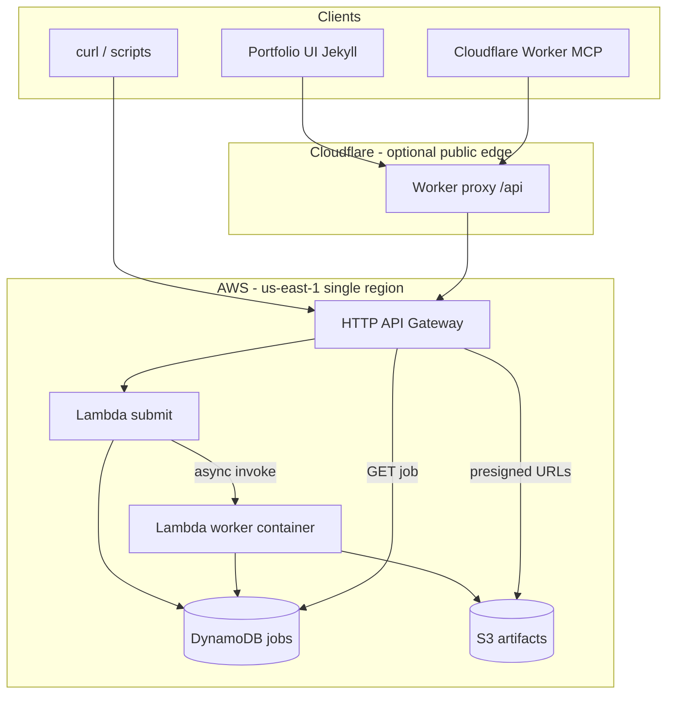

# Serverless AWS DESeq — implementation plan

> **Optional infrastructure.** This path is **not used by the production portfolio page**, which ships a static sample demo from `outputs/`. Use AWS serverless only on preview branches for personal QA. See the main demo README for the preview-only policy.

**Branch:** `dev-serverlessDeSeq`  
**Scope:** `demos/agent-accessible-workflows` + portfolio page + Cloudflare gateway  
**Goals:** Remove Oracle Cloud references; deploy real (trimmed) PyDESeq2 on AWS Lambda; stay within Free Tier for demo traffic; wire the agent-accessible portfolio UI and MCP gateway to the new API.

---

## 1. Target architecture



| Component | Responsibility |
|-----------|----------------|
| **HTTP API** | `POST /tools/run_deseq`, `GET /jobs/{id}`, `GET /healthz` — same paths as local FastAPI |
| **Submit Lambda** | Auth, validate payload, create job row, async-invoke worker, return `{ job_id, status: "queued" }` |
| **Worker Lambda** (container image) | Generate synthetic counts in memory, run PyDESeq2 **serverless profile**, write artifacts to S3, update DynamoDB |
| **DynamoDB** | Job status, manifest summary, artifact keys (TTL 7 days) |
| **S3** | `runs/{job_id}/results.csv`, `volcano.png`, `manifest.json` (lifecycle expire 7 days) |
| **Cloudflare Worker** | Keep existing MCP; set `API_BASE_URL` to API Gateway URL (no Oracle/VM backend) |

**Not in scope:** Redis, RQ, MinIO, Docker Compose on AWS, EC2, Oracle Cloud.

---

## 2. Oracle Cloud removal (Phase 0) — done

Both demo trees had identical OCI Terraform copies; they were removed repo-wide:

| Action | Path |
|--------|------|
| Deleted folder | `demos/agent-accessible-workflows/src/oracle-cloud/` |
| Deleted folder | `demos/agent-contaminant-investigation/src/oracle-cloud/` |
| Removed README section | `demos/agent-accessible-workflows/README.md` — replaced with AWS serverless pointer |
| Repo grep | No deployment paths referencing `oracle-cloud`, `OCI`, or `oracle/oci` in markdown or CI |

Contamination demo: no main README Oracle section existed; deleting `src/oracle-cloud/` was sufficient. AWS/serverless work applies to DESeq only on this branch.

---

## 3. “Serverless” DESeq profile (real but Free-Tier safe)

Add `serverless` (and keep `small` for local Docker only) in Python and API validation.

| Setting | Local `medium` | AWS `serverless` |
|---------|----------------|------------------|
| Genes | 5,000 | **100** |
| Samples | 24 | **8** (4 control / 4 treated) |
| Design | `~batch+condition` | **`~condition` only** |
| `n_cpus` | 2 | **1** |
| Artifacts | 10+ files | **`results.csv`**, **`top_genes.csv`**, **`volcano.png`**, **`manifest.json`** |
| Plots | 4 PNGs + HTML | **volcano only** |
| Target duration | minutes | **&lt; 60 s** @ 2048 MB Lambda (100 genes minimizes memory and GB-seconds) |

Implementation: extend `worker/run_job.py` with optional `DeseqConfig` flags or `run_deseq_serverless()` wrapper used only by the Lambda handler. Local FastAPI can accept `synthetic_profile: "serverless"` for parity testing.

---

## 4. AWS layout in the repo

```
demos/agent-accessible-workflows/
  docs/
    SERVERLESS-AWS-PLAN.md          # this file
  src/
    aws-serverless/
      README.md                     # deploy, destroy, smoke test
      terraform/                    # or SAM template.yaml — pick one below
        main.tf
        variables.tf
        outputs.tf
        lambda_submit.tf
        lambda_worker.tf
        api_gateway.tf
        dynamodb.tf
        s3.tf
        iam.tf
      lambda/
        submit/
          handler.py
        worker/
          handler.py
          Dockerfile                # PyDESeq2 container image
      terraform.tfvars.example
  # existing: api/, worker/, gateway/ unchanged for local dev
```

**IaC choice:** **Terraform** in-repo (matches your earlier direction; state local or S3 backend documented in README). Alternative: AWS SAM for faster `sam local invoke` — optional later.

**Free-tier guardrails in Terraform variables:**

- `worker_memory_mb = 2048` (tune after first invoke)
- `worker_timeout = 120`
- `reserved_concurrent_executions = 2` on worker
- No NAT Gateway, no ALB, no ElastiCache
- S3 lifecycle + DynamoDB TTL
- `aws_budgets_budget` alert at $1 (optional resource)

---

## 5. API contract (unchanged for UI/MCP)

Keep compatibility with `assets/js/deseq-workflow-ui.js` and `gateway/src/index.ts`:

| Method | Path | Behavior |
|--------|------|----------|
| `GET` | `/healthz` | `{ "status": "ok" }` |
| `POST` | `/tools/run_deseq` | Body = existing `DeseqRunRequest`; force or default `synthetic_profile: "serverless"` in AWS |
| `GET` | `/jobs/{job_id}` | Same JSON shape as FastAPI: `status`, `artifacts`, `top_genes`, `manifest` fields |

Artifact URLs: return presigned S3 GET URLs (1h TTL) in `artifacts[].url` so the portfolio UI can load PNG/CSV without embedding tokens in paths.

Auth: `Authorization: Bearer ${API_TOKEN}` — store token in AWS Secrets Manager or SSM Parameter Store; Lambdas read at cold start.

---

## 6. Portfolio page integration

File: `portfolio/agent-accessible-workflows.md`

| Environment | `DESEQ_WORKFLOW_CONFIG` |
|-------------|-------------------------|
| **Production (GitHub Pages)** | `demoMode: true` — static sample under `demos/agent-accessible-workflows/outputs/` (regenerate small manifest for serverless artifacts) |
| **Production + live AWS** | Set `apiBaseUrl` to API Gateway URL via Jekyll var or build-time secret (document in README; avoid committing URL if rotating) |
| **Jekyll `development`** | `apiBaseUrl: "http://localhost:8000"` (Docker) OR deployed API Gateway URL for integration testing |

UI changes (`assets/js/deseq-workflow-ui.js`):

1. Add **Serverless (AWS demo)** option to `#synthetic-profile` or map published live mode to `serverless` only.
2. When `apiBaseUrl` points to AWS, hide `large` / `medium` or show warning if selected.
3. Poll interval 2.5s (unchanged); handle `queued` → `running` → `completed`.
4. Demo note: explain published site uses static sample; live runs need Worker URL or configured API.

Optional Jekyll include for deploy URL:

```liquid
apiBaseUrl: "{{ site.deseq_api_url }}""",
demoMode: falsetrue
```

Add `_config.yml` keys: `deseq_api_url` (empty by default).

---

## 7. Cloudflare gateway

File: `demos/agent-accessible-workflows/src/gateway/wrangler.jsonc`

- `API_BASE_URL` → API Gateway stage URL (e.g. `https://xxxx.execute-api.us-east-1.amazonaws.com`)
- `API_JWT` → same bearer as Lambda
- MCP tools unchanged (`run_deseq`, `get_job_status`, …)

Deploy Worker after first `terraform apply`; smoke test via existing README curl patterns against `https://<worker>/api/...`.

---

## 8. Local development (keep Docker path)

| Mode | Command | Purpose |
|------|---------|---------|
| **Classic** | `start-demo.ps1` | FastAPI + Redis + worker — full profiles |
| **Serverless parity** | `sam local invoke` or invoke worker handler with env pointing at LocalStack (optional Phase 4) | Test Lambda package before deploy |
| **Against AWS** | Portfolio + `site.deseq_api_url` | End-to-end from browser |

Do **not** remove `docker-compose.yml` — it remains the local MVP.

---

## 9. CI

Extend `.github/workflows/agent-workflow-ci.yml`:

| Job | Steps |
|-----|--------|
| `python-pipeline` | Keep: ruff, generate, `run.py` with **small** data |
| `serverless-package` (new) | Build worker Docker image; `terraform validate`; optional `pytest` for submit/worker handlers with moto |
| **No** `terraform apply` in CI | Manual deploy only |

Regenerate committed `outputs/` for portfolio demo mode (small/serverless-sized manifest + volcano + results) — restore files currently gitignored on branch if Pages needs them.

---

## 10. Implementation phases

### Phase 0 — Cleanup (0.5 day)
- [x] Delete `src/oracle-cloud/` (DESeq + contamination demos)
- [x] Update DESeq README, remove Oracle section
- [x] Branch `dev-serverlessDeSeq` (done)

### Phase 1 — Serverless profile in Python (1 day)
- [x] Add `serverless` to `SYNTHETIC_PROFILES` in `api/main.py` — e.g. `{ genes: 100, samples: 8, n_de: 20, seed: 42 }`
- [x] Implement trimmed `run_deseq` path (fewer plots/artifacts)
- [x] CI FastAPI smoke test uses `serverless` profile
- [x] Regenerate static `outputs/` for GitHub Pages demo mode (`scripts/regenerate-portfolio-outputs.py`)

### Phase 2 — Lambda worker container (1–2 days)
- [x] `aws-serverless/lambda/worker/Dockerfile` from `Dockerfile.worker` + slim deps
- [x] Handler: parse event → run job → S3 upload → DynamoDB update
- [ ] Manual test: invoke on AWS with test event

### Phase 3 — Submit + API Gateway + data stores (1 day)
- [x] API Lambda + async invoke worker
- [x] DynamoDB table `deseq-jobs`
- [x] S3 bucket `deseq-runs-{account}-{region}`
- [x] HTTP API routes + CORS for portfolio origin + Worker

### Phase 4 — Terraform + docs (0.5 day)
- [x] `terraform.tfvars.example`, deploy/destroy runbook in `aws-serverless/README.md`
- [x] Outputs: `api_base_url`, `artifact_bucket`
- [x] Budget alarm instructions

### Phase 5 — Portfolio + gateway (0.5 day)
- [x] Jekyll `deseq_api_url` + UI profile option
- [x] Wrangler / gateway README documents `API_BASE_URL`
- [ ] Deploy Worker with new `API_BASE_URL` (manual after `terraform apply`)

### Phase 6 — Hardening (ongoing)
- [x] CI: `terraform validate` (no apply)
- [x] Manual smoke checklist in `aws-serverless/README.md`
- [ ] Load test: 10 concurrent submits stay within free tier
- [ ] CloudWatch alarms on errors/duration

---

## 11. Cost model (demo traffic)

Assume **serverless** profile (100 genes) @ 2 GB × 30–45 s ≈ **60–90 GB-seconds** per job.

| Monthly jobs | GB-seconds | Within ~400k free tier? |
|--------------|------------|-------------------------|
| 50 | 6,000 | Yes |
| 500 | 60,000 | Yes |
| 3,000+ | 360,000+ | Risky — add concurrency cap |

Plus: S3 storage pennies; DynamoDB on-demand within free tier at low volume; API Gateway HTTP API free tier for &lt;1M requests/month.

---

## 12. Success criteria

1. No Oracle Cloud deployment paths under either DESeq or contamination demos.
2. `terraform apply` produces a working API URL; `verify-demo` equivalent curl succeeds.
3. Portfolio page can submit a live job when `deseq_api_url` is set; otherwise static demo works on GitHub Pages.
4. MCP `run_deseq` → poll → `get_deseq_results_summary` works through the Worker.
5. A single serverless job produces real PyDESeq2 statistics (not mocked JSON).

---

## 13. Out of scope (this branch)

- Contamination investigation workflow AWS/serverless migration
- User-uploaded RNA-seq files
- Multi-region HA
- Replacing Cloudflare with API Gateway custom domain (optional later)

---

## 14. Open decisions

| Decision | Recommendation |
|----------|----------------|
| Terraform vs SAM | **Terraform** for consistency with prior planning |
| Public API URL on Pages | Jekyll `site.deseq_api_url` — empty until you deploy |
| Keep `medium`/`large` locally? | **Yes** — Docker only |
| Batch column in serverless UI | Hide or ignore on AWS (design without batch) |

---

*Next step after plan approval: execute Phase 0 + Phase 1 on `dev-serverlessDeSeq`.*
